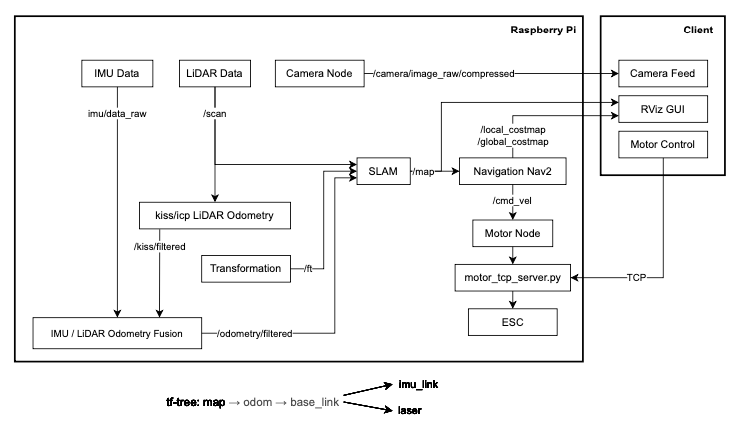
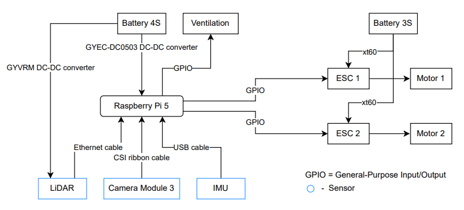
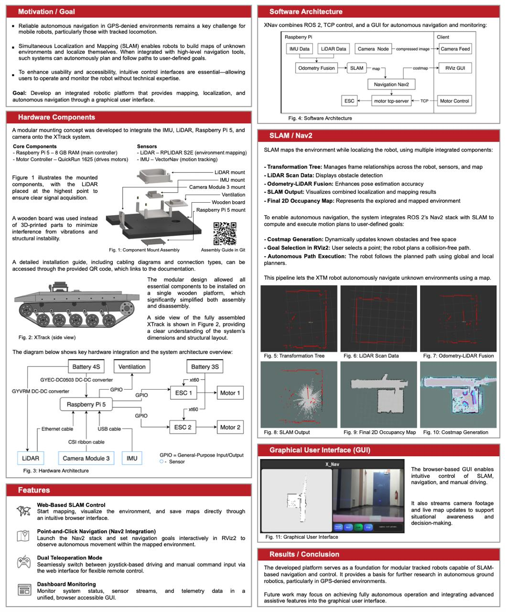

<!-- trunk-ignore-all(markdownlint/MD033) -->
<!-- trunk-ignore(markdownlint/MD041) -->
<div align="center">

  <h3 style="font-size: 25px;">
    Autonomous Driving Tracked Robot
  </h3>
  <br/>


  </div>
</div>

&#x20;

&#x20;

&#x20;

> Last updated: July 2025  
>
> This was my first large robotics project and several months of work went into it.  
>
> The repository should be viewed primarily as an inspiration and reference implementation rather than a strict step-by-step guide, since your hardware, sensors, wiring, sensors, and robot platform may differ.
>
> The full system was tested extensively and worked reliably in practice. It was tested many times not only by me, but also by other people using the same setup.

# Table of Contents

* [Overview](#overview)
* [Features](#features)
* [System Architecture](#system-architecture)
* [Installation](#installation)

  * [Requirements](#requirements)
  * [SSH Setup](#ssh-setup)
  * [Clone Repository](#clone-repository)
  * [Dependencies Installation](#dependencies-installation)
  * [Launch SLAM](#launch-slam-on-raspberry-pi-5)
  * [Launch Nav2](#launch-nav2)
  * [Start the Web GUI](#start-the-web-gui)
* [Assembly Guide](#assembly-guide)
* [Poster](#poster)


# Overview

Autonomous Driving Tracked Robot is a complete ROS 2-based robotics stack for a tracked autonomous robot. It allows you to drive, localize, navigate, and monitor the robot from a single responsive web interface.

<br>

<div align="center">

| Core Stack | Robot Capabilities |
|------------|--------------------|
| ROS 2 Jazzy | Browser-Based Control |
| SLAM Toolbox | Mapping & Navigation |
| Nav2 | Autonomous Navigation |
| LiDAR + IMU Localization | Sensor Fusion |
| TCP Motor Control | Manual Teleoperation |
| Web GUI | Real-Time Monitoring |
</div>
<br>

# Features

* **Browser-based SLAM Control:** Initialize mapping, build environments, and save map data directly from the web interface.
* **Integrated Nav2 Navigation:** Launch the Nav2 stack, set goals, and observe autonomous driving-all with a single click.
* **Dual-Mode Teleoperation:** Switch seamlessly between joystick-driven control and manual tele-op commands.
* **Live Dashboard Monitoring:** View real‑time system status, sensor data, and robot telemetry in one consolidated GUI.

# System Architecture

The stack integrates multiple ROS2 nodes, TCP control servers, and a web GUI into a unified navigation framework:



# Installation

## Requirements

* Ubuntu 24.04 workstation with ROS2 Jazzy
* Raspberry Pi5 running Ubuntu 24.04 with ROS2 Jazzy

## Clone Repository

> 📁 **Note**: It is assumed you are cloning the repository into your home directory `~`,  
> so that the path `~/autonomous-driving-tracked-robot` is valid in all instructions below.

On your local machine, clone the project:

```bash
cd ~
git clone https://github.com/myronsydorov/autonomous-driving-tracked-robot
```

## Dependencies Installation

On your Ubuntu 24.04 workstation with ROS 2 Jazzy:

```bash
Before running the project, make sure all required ROS 2 and Python dependencies are installed.
```

## SSH Setup
 
Before continuing, make sure your workstation and Raspberry Pi 5 are connected to the same network and that SSH is enabled on the Raspberry Pi.

```bash
# Open a new terminal on your workstation

# Connect to the Raspberry Pi using its hostname
ssh <username>@<raspberry-pi-hostname-or-ip>
```
> **Note:** Make sure you can successfully connect to your Raspberry Pi 5 before proceeding with the following steps.

# Workflows

## Manual Workflow

#### Run Motor Server (on Raspberry Pi 5)

```bash
cd ~/autonomous-driving-tracked-robot/ros2_ws/src/server/server
sudo python3 -m main
```

#### Start Motor Client (on Workstation)

```bash
# Connect your controller
cd ~/autonomous-driving-tracked-robot/ros2_ws/src/motors/motors
python3 -m motor_tcp_client_controller
```

> **Note:** Use the cable controller only; Bluetooth can be flaky.

### 1️⃣ Launch SLAM (On Raspberry Pi 5 new terminal)

```bash
ros2 launch ~/autonomous-driving-tracked-robot/ros2_ws/src/slam/launch/slam_toolbox.launch.py
```

(Optional in new terminal on workstation) Visualize in RViz2:

```bash
rviz2
```

### 2️⃣ Launch Nav2 (on RPI5 new terminal)

With SLAM running and a map available:

```bash
#new terminal
ros2 launch nav2_bringup bringup_launch.py
```
```bash
#new terminal
ros2 run robot_control motor_node
```

(Optional) Visualize in RViz2:

```bash
rviz2
```

## Web GUI Workflow

To drive everything via the Web GUI, follow these steps in order:

#### 1️⃣ Run Server (on Raspberry Pi 5)

```bash
cd ~/autonomous-driving-tracked-robot/ros2_ws/src/server/server
sudo python3 -m main
```

#### 2️⃣ Start the Web GUI Host (on Workstation)

```bash
cd ~/autonomous-driving-tracked-robot/ros2_ws/src/gui/gui
python3 -m webpage_host
```

> **Note:** Once both services are running, open your browser at `http://127.0.0.1:5000/` (tested only in Google Chrome).

> **The Camera and Nav2 functions can be launched either through the GUI by pressing the corresponding buttons or manually from the command line.**
>
> * **Start Camera Script:**
>
>   ```bash
>   cd ~/autonomous-driving-tracked-robot/scripts/launch
>   ./launch_cam.sh
>   ```
> * **Start Nav2 Script:**
>
>   ```bash
>   cd ~/autonomous-driving-tracked-robot/scripts/launch
>   ./launch_xnav2.sh
>   ```


---
# Assembly Guide

<h2>🧰 Required Components</h2>
<p>Before beginning the assembly process, ensure you have all the following components:</p>
<ul>
  <li>Raspberry Pi 5</li>
  <li>LiDAR Sensor</li>
  <li>Inertial Measurement Unit (IMU)</li>
  <li>Camera Module 3</li>
  <li>Motor Controller</li>
  <li>Micro USB Cable</li>
  <li>GYVRM DC-DC converter</li>
  <li>GYEC-DC0503 DC-DC converter</li>
  <li>3S Battery</li>
  <li>4S Battery</li>
  <li>USB-C Cable</li>
  <li>Color-Coded Pin Cables</li>
</ul>


Refer to the image below for a clearer understanding of the setup:
<figure style="text-align: center;">
  
  <figcaption>Figure 1</figcaption>
</figure>

Verify the following components are properly connected to the Raspberry Pi 5:
<figure style="text-align: center;">
  
  <figcaption>Figure 2</figcaption>
</figure>

<h4> Step A (Refer to Figure 2): </h4>
Connect the four color-coded pin cables (yellow, orange, green, and blue) to the ESC (Electronic Speed Controller) sensors. It is crucial to connect each cable to the correct ESC pins as specified:
<br/>
<br>

<p><strong>Left Motor:</strong></p>
<ul>
  <li>Yellow &rarr; Black</li>
  <li>Orange &rarr; White</li>
</ul>

<p><strong>Right Motor:</strong></p>
<ul>
  <li>Blue &rarr; Black</li>
  <li>Green &rarr; White</li>
</ul>

For motor orientation (left vs. right), refer to the following image of the X-Truck viewed from above:
<figure style="text-align: center;">
  
  <figcaption>Figure 3</figcaption>
</figure>


<h4>Step B (Refer to Figure 2):</h4>
Connect the 4S battery to the Raspberry Pi 5 via the USB-C connector (b, Fig. 2).

To avoid confusion between different batteries, refer to the following image for identification: 

<figure style="text-align: center;">
  
  <figcaption>Figure 4</figcaption>
</figure>

To power the Raspberry Pi 5 using the 4S battery, an adapter is required:

<figure style="text-align: center;">
  
  <figcaption>Figure 5</figcaption>
</figure>

<ol>
  <li>First, connect the 4S battery using cable e (Fig. 5).</li>
  <li>Then, connect it to the Raspberry Pi 5 using cable d (Fig. 5).</li>
</ol>


<h4>Step C (Refer to Figures 2 & 5):</h4>

<ul>
  <li>Connect the LiDAR sensor to the 4S battery using cable c (Figure 5).</li>
  <li>Connect the LiDAR sensor to the Raspberry Pi 5 using an Ethernet cable (c, Figure 2).</li>
</ul>


<h4>Step D (Refer to Figure 2):</h4>

<ul>
  <li>Connect the camera to the Raspberry Pi 5 using a CSI ribbon cable.</li>
</ul>


<h4>Step E (Refer to Figure 2):</h4>

<ul>
  <li>Connect the IMU (Inertial Measurement Unit) to the Raspberry Pi 5 via USB.</li>
</ul>


<h4>Final Step:</h4>

Once all components are connected (especially, ensuring the motors are correctly wired), connect the 3S battery to the motors using cable g (Figure 3).


The diagram below illustrates the interconnection of the hardware components, providing a clear overview of the system’s architecture:

<figure style="text-align: center;">
  
  <figcaption>Figure 6</figcaption>
</figure>


# Poster

The following poster provides a high-level overview of the project, including the motivation, hardware setup, software architecture, SLAM and Nav2 pipeline, GUI, and final system capabilities.

<figure style="text-align: center;">
  
  <figcaption>Figure 7</figcaption>
</figure>


